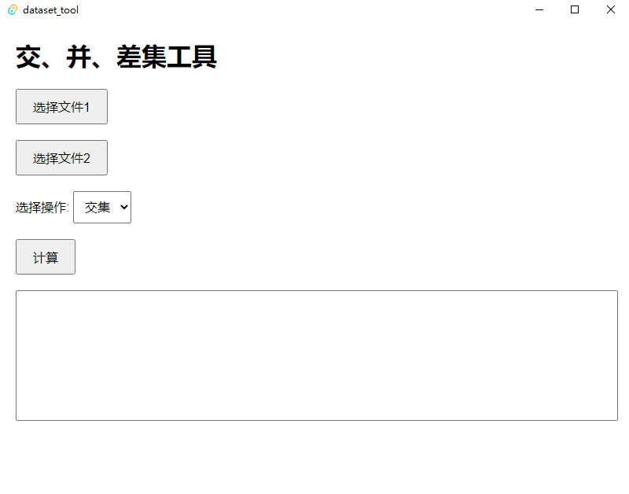

# dataset_tool

## 一、描述

这是一个用于处理数据集【交集、并集、差集】的 GUI 工具，基于 Rust 语言和 Tauri 框架开发。

在 release 目录下有构建好的 Windows 的可执行文件。

## 二、界面



## 三、本地启动

```bash
cd src-tauri
cargo tauri dev
```

## 四、构建可执行程序 & 安装包

```bash
cd src-tauri
cargo tauri build
```